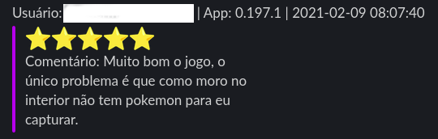

### Extract app comments and send it to a Slack channel

Simple Python script to read app comments from Google Play and send it to a Slack channel

### Requirements:

- Python3: https://www.python.org/downloads/
- Google Play Scrapper Module: https://pypi.org/project/google-play-scraper/


#### Usage:

1 - Create a Slack Incoming Webhook:
https://api.slack.com/messaging/webhooks

2 - Create and activate a virtual env:
```
$ cd app_review_slack
$ sudo apt install python3-venv
$ python3 -m venv .venv
$ source .venv/bin/activate
```

3 - Install the modules:
```
$ python3 -m pip install -r requirements.txt
```

4 - Open the **app_review_slack.py** file and set the app name and webhook url (lines 11 and 12):

```
webhook_url = 'put_your_slack_webhook_url_here'
app_name = 'put_your_app_name_here'
```

5 -Execute:
```
$ ./app_review_slack.py
```

#### Message sample:

